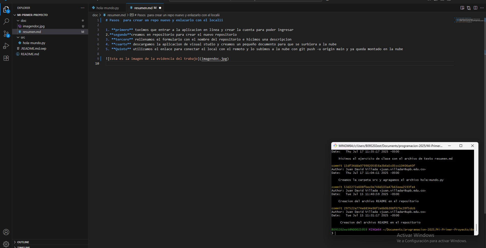

# Pasos  para crear un repo nuevo y enlazarlo con el localii

1. **primero** tuvimos que entrar a la aplicacion en linea y crear la cuenta para poder ingresar
2.**segundo**creamos en repositorio para crear el nuevo repositorio
3. **tercero** rellenamos el formulario con el nombre del repositorio e hicimos una descripcion
4. **cuarto** descargamos la aplicacion de visual studio y creamos un pequeño documento para que se surbiera a la nube
5. **Quinto** utilizamos el enlace para conectar el local con el remoto y lo subimos a la nube con git push -u origin main y ya queda montado en la nube

